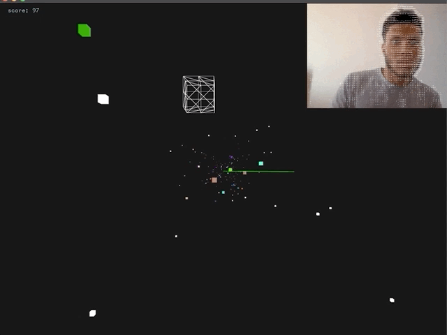

# openCv-Game
An openCV game where the player controls the avatar through a webcam using a technique called optical flow.

**Prerequisites:** openFrameworks (should work on lastest if not try v0.10.1), ofxCv, ofxOpenCv

**Step 1:** Download openFrameworks and follow the setup guide for your OS and IDE.

**Step 2:** Download or clone ofxCv into the openFrameworks/addons directory.

**Step 3:** Create a new project using the projectGenerator, which is located in the directory openFrameworks/projectGenerator. Then using the addons button, add ofxCv to the project.

**Step 4:** Open the project in your IDE then from inside your IDE delete all the files inside the src directory.

**Step 5:** Download or clone this repo then copy the files inside the src directory of this repo into the src directory of the project you created.

**Step 6:** Compile the project.

